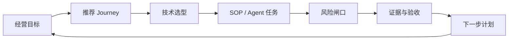

# PRD 2.0 ABI 智能化独立站经营作战台

## 0. 结论

本 PRD 2.0 已确认主定位为 **B. 经营作战台**。

它不是单纯知识库门户,也不是直接执行真实店铺动作的自动化控制台。它的产品任务是把 ABI 当前已有的 Shopify/DTC 知识资产、RAG/KG、工程仓库地图、增长 SOP、Agent 工作流、风险闸口和未来测试店自动化能力组织成一个可判断、可选择、可下钻、可验收的经营工作台。

一句话产品定义:

> ABI 经营作战台 = 独立站经营目标入口 + Shopify 技术选型中心 + SOP 执行库 + Agent OS + 证据与风险闸口。

## 1. 事实、推断、不确定项

### 1.1 已验证事实

本地代码与数据事实:
- 当前网站是静态优先单页站点,主文件为 `kb/site/index.html`。
- 站点数据由 `kb/_build/build_site_data.py` 生成到 `kb/site/kb_data.js`。
- 当前站点数据统计:14 个节点、558 个 chunks、253 个实体、776 条关系。
- 当前模块数量:10 个信息源、14 行覆盖矩阵、5 类工程路线、7 类增长打法、6 类 Agent、6 个风险闸口、7 个 skill 工具入口。
- 当前 0 文档节点为 `04-内容与素材生产`、`08-订单履约与供应链`、`09-客户与会员运营`。
- 当前页面已包含:总架构、全景图、AI 开店 10 步、全流程节点、能力地图、经营作战台、工程仓库地图、增长作战室、Agent 工作流库、风控与人审闸、信息源覆盖、工具包、知识库检索、DeepSeek RAG 问答、路线图。
- DeepSeek API Key 当前采用页面手动录入方式,服务端不默认保存 Key。

知识库与 Runbook 事实:
- `PRD_ABI智能化独立站.md` 已覆盖 00-10 与 90-92 节点。
- `全自动运营蓝图.md` 已定义编排层、能力层、数据层,并要求读操作优先自动化、写操作过人审。
- `AI-Toolkit_UCP测试店受控写验收Runbook.md` 明确 T7 当前为 `blocked_auth`,需要测试店授权与逐次人审。
- `迭代方案与PRD_TODO.md` 记录 T7 真实读写待测试店授权。

官方技术面交叉验证:
- Hydrogen 适合作为 Headless Storefront 的 React/Storefront API 路线,不等同于普通主题改造。
- Admin GraphQL API 面向店铺管理对象和 mutation,后续任何写入都必须区分 token、scope、目标店铺和人审。
- Storefront API / Storefront MCP 更适合面向买家的浏览、商品、购物车、结账前链路,不能替代 Admin API 写店铺。
- Shopify Functions、Checkout UI extensions、Customer Account/Checkout surface 属于强目标面和版本约束能力,必须测试店验证。
- Shopify CLI、App 模板、AI Toolkit、Dev MCP 可作为开发和 Agent 接口,但 CLI/MCP 认证后仍不能绕过人审。

### 1.2 产品推断

- ABI 站点最强资产不是页面本身,而是已经沉淀的经营知识、来源证据、RAG/KG、工程路径和执行边界。
- 用户真正需要的不是“再读一篇资料”,而是回答:我现在处于什么阶段、该走哪条路、该用哪些工具、风险在哪、下一步产物是什么。
- 因此 PRD 2.0 的核心是把现有内容从“资料卡片”升级为“任务路径 + 技术决策 + SOP + 证据 + 审批状态”。

### 1.3 不确定项与边界

- 当前没有 Shopify 测试店授权,因此不设计真实执行按钮,只设计 T7 readiness 与 Runbook。
- 平台规则、广告算法、SEO/GEO、Reddit 社区规则等时效性内容只展示验证状态,不包装成官方事实。
- 本 PRD 阶段不调用 provider,不创建 Shopify 测试店,不做外部平台写操作。

## 2. 产品目标

### 2.1 用户目标

用户进入网站后应能完成五件事:

1. 判断当前独立站经营阶段和推荐路径。
2. 选择 Shopify 技术路线:Theme、Hydrogen、App、Extension、MCP/UCP。
3. 进入可执行 SOP:输入、步骤、输出、验收、风险。
4. 查看 Agent 工作流:输入、工具、产出、人审点、禁止动作。
5. 明确哪些动作当前可做,哪些需要测试店、API Key、外部核验或人工批准。

### 2.2 业务目标

- 把 ABI 从知识沉淀升级为经营决策入口。
- 降低用户理解 Shopify AI 自动化体系的成本。
- 为 T6 多源萃取、T7 测试店读写、后续 Agent 编排保留产品容器。
- 保持安全边界:无授权不写店铺,无 Key 不调用 provider,无外部核验不升级事实等级。

### 2.3 成功指标

P0 上线后,网站应支持用户在 3 分钟内回答:
- 新店 0-1 先做什么。
- 当前该选 Theme、Hydrogen、App 还是 MCP。
- Creator Store Front / Reddit GEO / YouTube PR 该进入哪个 SOP。
- T7 为什么还不能执行真实店铺写入。
- 某个结论来自哪个信息源,验证状态是什么。
- 哪些节点仍然是内容债。

## 3. 产品骨架

经营作战台由六层组成:

1. 经营入口层:阶段、目标、路径、下一步建议。
2. 技术决策层:Shopify 工程路线与能力边界。
3. SOP 执行层:每个场景的输入、步骤、输出、验收。
4. Agent 协作层:Agent 角色、工具、数据、产出、人审。
5. 证据治理层:来源、验证状态、覆盖度、可信边界。
6. 自动化准备层:T7 测试店 readiness、Runbook、审批台账入口。

核心闭环:



## 4. 信息架构

### 4.1 MVP 实现方式

MVP 仍保持 `kb/site/index.html` 单页静态站点,通过锚点分区模拟页面。这样可以复用当前构建方式,不引入路由框架。

后续如果迁移到 React/Next/Vite,再把每个区块升级为路由页面。

### 4.2 顶部导航

桌面导航顺序:

1. 作战台
2. 路径
3. 技术
4. 节点
5. SOP
6. 增长
7. Agent
8. 风控
9. 证据
10. 问答

移动端:
- 左侧品牌。
- 右侧保留 DeepSeek 问答按钮。
- 增加菜单按钮,展开后显示同样导航。
- 菜单项点击后关闭抽屉并滚动到目标区块。

### 4.3 页面级区块

| 序号 | 区块 | 锚点 | P0/P1 | 目标 |
|---|---|---|---|---|
| 1 | Command Center | `#command` | P0 | 首屏经营状态与路径入口 |
| 2 | Journey Selector | `#journeys` | P0 | 按经营目标选路径 |
| 3 | Technical Decision Center | `#tech` | P0 | Shopify 技术路线选择 |
| 4 | Flow Node OS | `#nodes` | P0 | 14 节点任务化 |
| 5 | SOP Playbook Library | `#sop` | P1 | 场景 SOP 库 |
| 6 | Growth War Room | `#growth` | P0 | 全域增长打法 |
| 7 | Agent OS | `#agents` | P0 | Agent 工作流 |
| 8 | Execution Readiness | `#readiness` | P0 | T7/权限/风险状态 |
| 9 | Evidence & Trust Center | `#evidence` | P0 | 来源和验证状态 |
| 10 | Search & Ask | `#ask` | P0 | 检索与手动 Key 问答 |
| 11 | Roadmap & Debt | `#roadmap` | P0 | 内容债与后续计划 |

## 5. 视觉与 UI 设计系统

### 5.1 设计方向

关键词:
- 专业
- 高密度
- 可扫描
- 工具型
- 风险可见
- 证据可追溯

避免:
- 营销落地页式大 Hero。
- 只展示口号的卡片堆叠。
- 过多单色渐变。
- 隐藏风险状态。
- 把未授权能力做成可点击执行按钮。

### 5.2 色彩

延续当前站点基础色,但减少渐变依赖:

| Token | 值 | 用途 |
|---|---|---|
| `--ink` | `#0B1F3A` | 主文字 |
| `--navy` | `#13294B` | 页脚、深色标题、技术线 |
| `--green` | `#008060` | 主行动、通过状态、Shopify 主信号 |
| `--indigo` | `#5C6AC4` | AI/Agent/知识图谱 |
| `--teal` | `#0E7C86` | 数据与归因 |
| `--amber` | `#C98A00` | 待授权、人审、谨慎状态 |
| `--danger` | `#A51C30` | 阻断、外部待核验、禁止动作 |
| `--bg` | `#F4F7FB` | 页面背景 |
| `--card` | `#FFFFFF` | 卡片 |
| `--line` | `#E1E8F0` | 分割线 |

### 5.3 组件尺寸

- 页面最大宽度:1180px。
- 外边距:桌面 24px,移动 16px。
- 新组件卡片圆角:8px。
- 旧组件可逐步从 13/14px 收敛到 8px。
- 主按钮高度:40px。
- 次按钮高度:36px。
- 卡片内边距:16px。
- 表格字体:12-13px。
- 主标题:32px 桌面,26px 移动。
- 区块标题:26-30px 桌面,22px 移动。

### 5.4 状态标签

统一五类状态:

| 状态 | 文案 | 颜色 | 含义 |
|---|---|---|---|
| `local_ready` | 本地可用 | green | 不需要外部授权 |
| `manual_review_required` | 需人审 | amber | 可准备,执行前必须确认 |
| `requires_user_input` | 待用户输入 | amber | 需要 API Key、测试店或资料 |
| `blocked_auth` | 授权前置 | danger | 当前不可执行 |
| `needs_external_verification` | 待外部核验 | danger | 不能写成官方事实 |

### 5.5 可访问性要求

- 所有按钮、卡片详情入口、表单输入必须有可见 focus 样式。
- 移动端导航不可只隐藏链接,必须有菜单入口。
- 表格在移动端转换为卡片或横向滚动容器,并显示溢出提示。
- API Key 输入框必须有 label,不能只靠 placeholder。
- 状态不能只用颜色表达,必须有文字。

## 6. 页面详细 PRD

## Page 1. Command Center

### 6.1 页面目标

首屏替代当前介绍型 Hero,让用户立即看到 ABI 当前能做什么、不能做什么、下一步该走哪条经营路径。

### 6.2 用户问题

- 我现在能从哪里开始?
- ABI 现在有哪些资产?
- 哪些动作可本地完成,哪些需要授权?
- 我是新店、老店、技术改造还是增长放量?

### 6.3 桌面布局

首屏采用两栏:

左栏 60%:
- 产品名:ABI 智能化独立站经营作战台。
- 一句话说明:从 Shopify 知识库到可执行经营路径。
- 主行动按钮:
  - 选择经营路径
  - 查看技术选型
  - 查看风险状态
- 资产 KPI 行:
  - 14 节点
  - 558 chunks
  - 253 实体
  - 776 关系

右栏 40%:
- `Execution Snapshot` 状态面板。
- 4 个状态卡:
  - 本地知识库:local_ready
  - RAG/KG/site:local_ready
  - DeepSeek 问答:requires_user_input
  - Shopify 测试店写入:blocked_auth
- 底部显示当前红线:
  - 不保存 API Key
  - 测试店先行
  - 写操作需人审
  - 时效内容待核验

### 6.4 移动布局

- 标题、说明、按钮纵向排列。
- KPI 使用 2 列。
- 状态面板在 KPI 下方。
- 不显示大图 Hero,保留空间给路径入口。

### 6.5 数据字段

新增 `commandCenter`:

```json
{
  "title": "ABI 智能化独立站经营作战台",
  "subtitle": "把 Shopify/DTC 知识、工程选型、增长 SOP、Agent 工作流和风险闸口组织成可执行经营路径。",
  "kpis": [{"label": "流程节点", "value": 14}],
  "snapshots": [
    {"label": "本地知识库", "status": "local_ready", "detail": "14 节点已入站点"},
    {"label": "DeepSeek 问答", "status": "requires_user_input", "detail": "页面手动录入 Key"},
    {"label": "T7 测试店写入", "status": "blocked_auth", "detail": "待测试店授权"}
  ]
}
```

### 6.6 交互

- 点击 `选择经营路径` 滚动到 Journey Selector。
- 点击状态卡进入 Execution Readiness。
- 点击 KPI `chunks/entities/relations` 进入 Evidence Center。

### 6.7 验收

- 首屏 960px 高度内能看到标题、KPI、状态卡和至少两个行动入口。
- 移动端 390px 宽度无不可控横向滚动。
- DeepSeek Key 未填写时,首屏不显示任何 provider 成功承诺。

## Page 2. Journey Selector

### 6.8 页面目标

用户不需要先理解 14 个节点,而是按经营目标进入推荐路径。

### 6.9 Journey 列表

P0 必须提供 7 条:

1. 新店 0-1 冷启动
2. 已有 Shopify 店铺诊断
3. Theme 快速上线
4. Hydrogen / Headless 改造
5. 站外全域增长
6. Creator Store Front / 联盟红人
7. T7 测试店自动化准备

### 6.10 桌面布局

顶部:
- 标题:按目标选择作战路径。
- 筛选器:阶段、风险、技术复杂度、是否需要授权。

主体:
- 3 列 Journey 卡片。
- 每张卡:
  - 标题
  - 适用对象
  - 推荐节点标签
  - 预计产出
  - 主要风险状态
  - 主按钮:进入路径
  - 次按钮:询问此路径

右侧或下方详情面板:
- 点击 Journey 后显示:
  - 输入资料
  - 执行步骤
  - 推荐 SOP
  - 技术依赖
  - 风控闸口
  - 验收结果

### 6.11 移动布局

- 筛选器收成横向 chips。
- Journey 卡片单列。
- 详情面板使用 accordion。

### 6.12 数据字段

新增 `journeys`:

```json
{
  "id": "new-store-0-1",
  "title": "新店 0-1 冷启动",
  "stage": "P0",
  "audience": "品牌负责人 / 运营负责人",
  "nodes": ["00", "01", "02", "03", "05", "07", "91"],
  "inputs": ["品类 brief", "目标市场", "预算边界", "供应商线索"],
  "outputs": ["战略基线", "选品评分卡", "站点结构", "PDP 草稿", "UTM 规范"],
  "sops": ["独立站0到1建站SOP", "Listing内容工厂SOP"],
  "risk_gates": ["素材授权", "支付/域名/政策页", "广告预算"],
  "readiness": "local_ready",
  "ask_query": "我是 Shopify 新店冷启动,下一步应该按什么路径做?"
}
```

### 6.13 验收

- 每条 Journey 至少关联 3 个节点、1 个 SOP、1 个风险闸口。
- T7 Journey 必须显示 `blocked_auth` 或 `requires_user_input`,不能有执行按钮。
- 点击 `询问此路径` 后,搜索框或问答框自动填入对应 query。

## Page 3. Technical Decision Center

### 6.14 页面目标

把 GitHub P0 工程仓库地图升级为技术选型向导,帮助用户判断应该用 Theme、Hydrogen、App、Extension、CLI/MCP 还是 UCP readiness。

### 6.15 技术路线

| 路线 | 用途 | 当前证据 | 风险 |
|---|---|---|---|
| Theme / Liquid | 快速上线 Shopify 店铺页面 | Dawn / skeleton theme 快照 | 发布前需人工确认品牌、政策、支付 |
| Hydrogen | Headless Storefront | Hydrogen / Storefront API 官方路线 | 需要管理 token、部署、缓存、SEO |
| Shopify App | Admin API、审批网关、业务服务 | App template 快照 | 写操作必须 scope + preview + approval |
| Checkout/UI Extension | Checkout/Account surface | UI extensions / Checkout docs | target 与 api_version 敏感 |
| CLI / Dev MCP | 脚手架、校验、开发代理入口 | CLI / Dev MCP 资料 | 认证后仍需权限边界 |
| Storefront MCP / UCP | 面向买家和 AI channel readiness | 官方与本地 SOP 交叉 | 当前只做 readiness |

### 6.16 桌面布局

顶部:
- 标题:Shopify 技术选型中心。
- 说明:先选目标,再选工程路线,最后看风险。

左侧 35%:
- 决策问卷:
  - 是否已有 Shopify 店铺
  - 是否需要 Headless
  - 是否需要 Admin API
  - 是否涉及 Checkout
  - 是否涉及真实写入
  - 是否已有测试店授权

右侧 65%:
- 推荐路线卡:
  - 推荐主路线
  - 可选路线
  - 需要的源仓库/SOP
  - 禁止动作
  - 验收命令

底部:
- 技术矩阵表。

### 6.17 移动布局

- 决策问卷在上。
- 推荐结果在问卷下。
- 矩阵表改为卡片列表。

### 6.18 数据字段

新增 `technicalRoutes`:

```json
{
  "id": "hydrogen-headless",
  "label": "Hydrogen / Headless",
  "best_for": "需要 React 前端、复杂内容体验、Storefront API 与独立部署",
  "repo_refs": ["Shopify/hydrogen", "Shopify/storefront-api-examples"],
  "required_inputs": ["品牌 IA", "Storefront API token 策略", "部署目标", "SEO 要求"],
  "outputs": ["route_map", "storefront_api_boundary", "seo_cache_smoke"],
  "risk_gates": ["token_scope", "seo_cache", "deployment_rollback"],
  "readiness": "manual_review_required"
}
```

### 6.19 交互

- 用户勾选问卷后,推荐路线实时更新。
- 每条路线可点击 `查看证据`,跳到 Evidence Center。
- 每条路线可点击 `进入 SOP`,跳到 SOP Playbook。

### 6.20 验收

- 用户选择“需要快速上线,无复杂前端”时推荐 Theme。
- 用户选择“需要 Headless/React/高自定义”时推荐 Hydrogen。
- 用户选择“需要改商品/订单/价格”时必须显示 Admin API + 人审闸。
- 用户选择“涉及 Checkout”时必须显示测试店与版本约束。

## Page 4. Flow Node OS

### 6.21 页面目标

把 14 个节点从知识目录升级为任务节点,每个节点展示输入、输出、SOP、Agent、风险、内容覆盖状态。

### 6.22 桌面布局

顶部:
- 标题:经营流程节点。
- 筛选:流程节点 / 横切层 / 内容债 / 待授权。

主体:
- 节点网格 7x2 或 6x3。
- 每个节点卡:
  - 编号
  - 名称
  - 文档数
  - chunks 数
  - readiness 标签
  - 关联 Agent 数
  - 风险闸数

详情面板:
- 点击节点后展开下方 panel。
- panel 左侧:
  - 节点目标
  - 核心子主题
  - 输入
  - 输出
- panel 右侧:
  - 专题文档
  - 推荐 SOP
  - Agent
  - 风控闸
  - Ask about this

### 6.23 移动布局

- 节点卡 2 列,详情变为全宽 accordion。
- 文档 chips 换行,不出现横向溢出。

### 6.24 数据字段

新增 `nodeReadiness`:

```json
{
  "node": "04-内容与素材生产",
  "doc_count": 0,
  "chunk_count": 0,
  "status": "content_debt",
  "reason": "当前只有 README,缺少素材生产专题文档",
  "recommended_docs": ["AI素材标签化SOP", "UGC素材授权SOP", "广告素材测试矩阵"]
}
```

### 6.25 验收

- `04/08/09` 必须显示内容债。
- 任何 0 文档节点不得显示为 ready。
- 每个节点详情必须能看到来源和推荐下一步。

## Page 5. SOP Playbook Library

### 6.26 页面目标

把知识库中的专题文档和 SOP 汇总成可执行 playbook 库。

### 6.27 P0/P1 Playbook 列表

P0 至少 8 个:
- 新店 0-1 建站 SOP
- Listing 内容工厂 SOP
- HOME 页 SEO 与落地页承接 SOP
- 独立站全域流量增长 SOP
- 全域增长数据归因 SOP
- 社区营销与素材授权风控 SOP
- UCP 接入 SOP
- AI-Toolkit/UCP 测试店 Runbook

P1 补齐:
- AI 素材生产与授权 SOP
- 订单履约与库存同步 SOP
- 客户会员/VOC 闭环 SOP
- Creator Store Front 联盟红人 SOP

### 6.28 桌面布局

顶部:
- 标题:SOP Playbook Library。
- 筛选:节点、场景、验证状态、风险等级。

主体:
- 左侧 playbook 列表。
- 右侧详情阅读器。
- 详情阅读器包含:
  - 场景
  - 输入
  - 步骤
  - 输出物
  - 验收
  - 风险
  - 来源
  - 状态

### 6.29 移动布局

- Playbook 列表单列。
- 点击后打开全屏 modal 或下方展开。

### 6.30 数据字段

新增 `sopPlaybooks`:

```json
{
  "id": "home-seo-landing-sop",
  "title": "HOME 页 SEO 与落地页承接 SOP",
  "nodes": ["05", "06", "07"],
  "scenario": "自然搜索与站外流量进入首页/落地页后的承接",
  "inputs": ["关键词", "渠道意图", "目标页面", "GSC/GA 数据"],
  "steps": ["确认意图", "调整首页结构", "补 FAQ/schema", "打 UTM", "复盘"],
  "outputs": ["keyword_map", "landing_page_brief", "measurement_plan"],
  "risks": ["SEO/GEO 时效内容需外部核验"],
  "source_files": ["kb/06-转化优化CRO/平台运营Wiki_HOME页SEO与落地页承接SOP.md"],
  "verification": "local_material_needs_external_verification"
}
```

### 6.31 验收

- 至少 8 个 playbook 可见。
- 每个 playbook 必须有来源路径。
- 需要外部核验的 playbook 必须显示状态。

## Page 6. Growth War Room

### 6.32 页面目标

把 7 类增长打法统一到一个经营闭环:渠道角色、内容资产、承接页面、归因、风险。

### 6.33 渠道

当前已验证有 7 类:
- SEO / GEO
- Meta / Google Ads
- Reddit GEO
- YouTube / PR
- KOL / UGC
- Affiliate / Creator Store Front
- Deal / 大促

### 6.34 桌面布局

顶部:
- 标题:增长作战室。
- 一行指标:渠道数、待核验规则数、人审闸数、可复用 SOP 数。

主体:
- 4 列渠道卡片。
- 每张卡:
  - 渠道名
  - 阶段角色
  - 核心动作
  - 输出物
  - 承接节点
  - 归因字段
  - 风险状态

下方:
- `Channel-to-Landing Map` 表:
  - 渠道
  - 流量意图
  - 推荐承接页
  - 内容资产
  - 指标
  - 风险

### 6.35 移动布局

- 渠道卡片单列。
- 表格改为每渠道 accordion。

### 6.36 数据字段

扩展 `growthPlaybooks`:

```json
{
  "channel": "Affiliate / Creator Store Front",
  "stage": "长期分销",
  "intent": "creator trust / deal intent",
  "action": "专属页面、链接、折扣码、佣金、订单归因",
  "landing": "creator_storefront / PDP / campaign landing",
  "metrics": ["creator_id", "utm_source", "coupon_code", "gross_margin"],
  "output": "affiliate_storefront_plan",
  "handoff": "05 增长 + 07 creator_id 归因",
  "risk": "佣金、折扣和 Cookie 规则必须透明记录"
}
```

### 6.37 验收

- 每个渠道必须有承接页和归因字段。
- Reddit、SEO/GEO、广告算法相关内容必须带 `needs_external_verification`。
- 预算、折扣、佣金必须进入风险闸。

## Page 7. Agent OS

### 6.38 页面目标

把 Agent 工作流从“能力卡片”升级为可审计任务单。

### 6.39 Agent 类型

P0 6 类:
- 市场洞察 Agent
- 内容素材 Agent
- 红人/联盟 Agent
- SEO/GEO Agent
- 广告诊断 Agent
- 经营复盘 Agent

P1 增补:
- 测试店准备 Agent
- 订单履约 Agent
- 客户/VOC Agent

### 6.40 桌面布局

顶部:
- 标题:Agent Operating System。
- 状态说明:当前为工作流设计与本地知识检索,不执行真实店铺写入。

主体:
- 3 列 Agent 卡。
- 卡片字段:
  - Agent 名称
  - 任务目标
  - 输入数据
  - 可调用工具
  - 输出物
  - 人审节点
  - 禁止动作
  - 适配节点

详情:
- 点击卡片打开任务模板:
  - Prompt brief
  - Input checklist
  - Output schema
  - Review gate
  - Evidence log

### 6.41 移动布局

- Agent 卡单列。
- 详情 modal 全屏。

### 6.42 数据字段

扩展 `agentWorkflows`:

```json
{
  "agent": "广告诊断 Agent",
  "mission": "识别广告浪费、胜出素材和落地页问题",
  "input": "广告报表、素材标签、落地页、订单",
  "tools": ["RAG search", "GA/GSC/Ads export", "knowledge snippets"],
  "output_schema": ["waste_reason", "winning_creative", "landing_page_issue", "next_action"],
  "review": "预算、上线、否词和素材替换",
  "forbidden_actions": ["自动扩预算", "自动发布广告", "使用未授权素材"],
  "nodes": ["05", "06", "07"]
}
```

### 6.43 验收

- 每个 Agent 必须有输入、输出、人审点、禁止动作。
- 涉及预算、外部发布、真实店铺写入的 Agent 不显示执行按钮。

## Page 8. Execution Readiness

### 6.44 页面目标

明确当前 ABI 哪些能力可做、哪些等待用户输入、哪些需要授权、哪些只做 readiness。

### 6.45 状态分类

| 能力 | 状态 | 说明 |
|---|---|---|
| 本地 KB/RAG/KG/site | local_ready | 可本地构建和检索 |
| DeepSeek RAG 问答 | requires_user_input | 需要页面手动录入 API Key |
| T6 多源入库 | requires_user_input | 需要字幕、清单或可复核文本 |
| Shopify 测试店读取 | blocked_auth | 需要用户授权测试店 |
| Shopify 测试店受控写入 | blocked_auth | 需要授权 + mutation 预案 + 人审 |
| UCP/Catalog readiness | needs_external_verification | 需按最新官方入口复核 |
| 社区/SEO/GEO 规则 | needs_external_verification | 时效规则不可直接当事实 |

### 6.46 桌面布局

顶部:
- 标题:执行准备度。
- 说明:这里不是执行台,是授权与证据状态台。

主体:
- readiness timeline:
  - 本地可用
  - 待用户输入
  - 待测试店授权
  - 待人审
  - 可执行测试店动作
- 右侧显示 T7 Runbook 摘要:
  - 只读连接检查
  - 读取基础信息
  - mutation preview
  - 人审批准
  - 执行低风险写入
  - 写后复查
  - 回滚/保留决定

### 6.47 移动布局

- timeline 纵向。
- T7 Runbook 使用步骤 accordion。

### 6.48 数据字段

新增 `executionReadiness`:

```json
{
  "id": "t7-controlled-write",
  "label": "T7 测试店受控写入",
  "status": "blocked_auth",
  "requires": ["test_store", "shopify auth login", "mutation preview", "explicit approval"],
  "forbidden": ["production store write", "payment", "refund", "real ad spend"],
  "runbook": "kb/10-自动化编排/AI-Toolkit_UCP测试店受控写验收Runbook.md"
}
```

### 6.49 验收

- T7 只能显示 readiness,不显示执行 CTA。
- 页面清楚写明测试店前置和人审前置。
- 不出现生产店写入承诺。

## Page 9. Evidence & Trust Center

### 6.50 页面目标

把信息源清单与覆盖矩阵升级为可筛选证据中心。

### 6.51 来源类型

当前 10 类:
- 周报/内部资料
- Twitter/书签
- Shopify 官方文档与账号
- GitHub
- YouTube
- 社区痛点
- Accio
- inbox 独立站资料
- platform-operations-wiki
- ABI 项目文档/Runbook

### 6.52 桌面布局

顶部:
- 标题:证据与可信度中心。
- 筛选:节点、来源类型、验证状态、是否待核验。

主体:
- 左侧 source registry。
- 右侧 coverage matrix。
- 下方 evidence cards:
  - 结论
  - 来源路径
  - 验证状态
  - 关联节点
  - 更新时间

### 6.53 移动布局

- Source registry 转成列表卡。
- Coverage matrix 默认折叠,按节点查看覆盖。

### 6.54 验收

- `needs_external_verification` 内容可以筛选出来。
- 点击某个节点能看到覆盖来源。
- 平台规则类资料必须显示本地资料或官方核验状态。

## Page 10. Search & Ask

### 6.55 页面目标

保留本地检索和 DeepSeek RAG 问答,并把问答与页面上下文绑定。

### 6.56 桌面布局

顶部:
- 标题:知识库检索与问答。
- 说明:无 Key 可检索,有 Key 可问答。

主体:
- 左侧本地搜索。
- 右侧问答助手。
- 下方预设问题 chips:
  - 我是新店冷启动,下一步做什么?
  - Theme vs Hydrogen 怎么选?
  - T7 当前为什么不能写测试店?
  - Creator Store Front 怎么落地?
  - 哪些内容需要外部核验?

Key 设置:
- 明确 label:DeepSeek API Key。
- 选项:仅本页使用 / 记住到本浏览器。
- 说明:不写入仓库,不写入服务器默认配置。

### 6.57 移动布局

- 搜索在上,问答在下。
- 问答输入固定在聊天区底部。
- API Key 设置默认折叠。

### 6.58 数据字段

新增 `queryPresets`:

```json
{
  "label": "Theme vs Hydrogen 怎么选?",
  "query": "Theme 与 Hydrogen 在 Shopify 独立站建站中如何选择?分别适合什么场景和风险边界?",
  "context": ["02", "10", "91"]
}
```

### 6.59 验收

- 无 API Key 时本地搜索可用。
- 未填 Key 时问答给出明确输入提示。
- 使用后端模式时 Key 只随本次请求转发。
- 每个 Journey/Agent/SOP 的 `Ask about this` 能写入问答框或搜索框。

## Page 11. Roadmap & Content Debt

### 6.60 页面目标

把当前能力、内容债和后续实施阶段透明化,防止用户把 readiness 理解成已执行。

### 6.61 桌面布局

顶部:
- 标题:路线图与内容债。
- 三个 tab:
  - P0 页面改造
  - P1 内容/SOP 补强
  - P2 测试店自动化

主体:
- 左侧路线图。
- 右侧内容债面板。
- 内容债必须列出:
  - `04-内容与素材生产`
  - `08-订单履约与供应链`
  - `09-客户与会员运营`

每个内容债卡:
- 当前文档数
- 缺口
- 推荐补文档
- 来源建议
- 验收方式

### 6.62 移动布局

- Tab 横向滚动。
- 内容债卡单列。

### 6.63 验收

- 0 文档节点必须出现在内容债区域。
- T7 显示为待授权,不显示已执行。
- P0/P1/P2 分期与 `.kiro/plan`、`迭代方案与PRD_TODO.md` 不冲突。

## 7. 数据模型总览

需要在 `kb/_build/build_site_data.py` 中新增或扩展以下对象:

| 对象 | 新增/扩展 | 用途 |
|---|---|---|
| `commandCenter` | 新增 | 首屏状态和 KPI |
| `journeys` | 新增 | 用例路径 |
| `technicalRoutes` | 新增 | 技术选型 |
| `nodeReadiness` | 新增 | 节点状态与内容债 |
| `sopPlaybooks` | 新增 | SOP 库 |
| `growthPlaybooks` | 扩展 | 增加 intent、landing、metrics |
| `agentWorkflows` | 扩展 | 增加 mission、tools、forbidden_actions、schema |
| `executionReadiness` | 新增 | T7 与授权状态 |
| `evidenceItems` | 新增 | 证据卡 |
| `queryPresets` | 新增 | 上下文问答 |
| `contentDebt` | 新增 | 0 文档节点与补齐计划 |

## 8. 技术实现计划

### 8.1 文件级改动

P0 预计改动:

1. `kb/_build/build_site_data.py`
   - 新增数据对象生成。
   - 从现有节点、source registry、coverage matrix、Runbook、GitHub P0 manifest 推导字段。
   - 对 0 文档节点生成 `contentDebt`。

2. `kb/site/index.html`
   - 重排顶部导航。
   - 把旧 Hero 改为 Command Center。
   - 新增 Journey、Technical Decision、Readiness、Debt 区块。
   - 扩展现有 Growth、Agent、Evidence、Search 区块。
   - 增加移动菜单。
   - 增加 focus 样式。

3. `kb/site/README.md`
   - 更新新模块说明。
   - 增加 API Key 与 readiness 边界。

4. `kb/04-内容与素材生产/AI素材生产与授权SOP.md`
   - P1 最小补文档。

5. `kb/08-订单履约与供应链/订单履约与库存同步SOP.md`
   - P1 最小补文档。

6. `kb/09-客户与会员运营/客户会员与VOC闭环SOP.md`
   - P1 最小补文档。

### 8.2 分期

P0: 页面结构与数据对象
- Command Center
- Journey Selector
- Technical Decision Center
- Node Readiness
- Execution Readiness
- Evidence filters
- Mobile navigation

P1: SOP 与内容补齐
- SOP Playbook Library
- `04/08/09` 最小专题文档
- Growth attribution fields
- Agent task templates

P2: T7 readiness 深化
- 测试店 readiness checklist
- 审批台账模板展示
- Storefront MCP/UCP readiness 面板
- 后续真实授权后再做执行链路设计

## 9. 验收计划

### 9.1 本地构建验收

```bash
python3 kb/_build/build_site_data.py
node --check kb/site/kb_data.js
python3 kb/_build/build_rag.py
cd kb/_rag/kb_index && python cli.py build && python eval_retrieval.py
```

### 9.2 页面验收

本地静态预览:

```bash
cd kb/site
python3 -m http.server 8765 --bind 127.0.0.1
```

检查:
- Command Center 首屏可见。
- Journey 至少 7 条。
- Technical routes 至少 6 条。
- SOP 至少 8 条。
- Agent 至少 6 条且包含 forbidden actions。
- Readiness 显示 T7 blocked_auth。
- Evidence 可筛选待外部核验。
- Search 无 Key 可用。
- 问答未填 Key 时提示用户填写。
- 移动端 390px 宽度可用。

### 9.3 设计验收

- 不出现卡片内文字溢出。
- 不出现导航在移动端消失且无入口。
- 状态标签不只依赖颜色。
- 表格移动端可阅读。
- 主要交互有 focus。
- 不把 readiness 设计成执行按钮。

### 9.4 证据验收

每个新增模块必须能回溯:
- 本地数据对象来源。
- 对应 KB 文件。
- 验证状态。
- 当前可执行边界。

## 10. 风险与防护

| 风险 | 表现 | 防护 |
|---|---|---|
| 把知识门户做成新卡片堆叠 | 页面信息多但没有路径 | 首屏必须有 Journey |
| 把未来能力写成当前能力 | T7/UCP 被误认为可执行 | Readiness 中标 blocked_auth |
| 平台时效规则过期 | SEO/GEO/广告规则变化 | 标记 needs_external_verification |
| 移动端导航不可用 | 链接隐藏后无菜单 | P0 增加移动菜单 |
| 表格无法阅读 | 覆盖矩阵过宽 | 移动端卡片化 |
| API Key 风险 | 用户误以为服务器保存 Key | Key 设置区固定展示边界 |
| 内容债被隐藏 | 0 文档节点被当成已完成 | Roadmap & Debt 强制展示 |

## 11. 开发拆解清单

### P0 任务

- [ ] 在 `build_site_data.py` 增加 `commandCenter`。
- [ ] 在 `build_site_data.py` 增加 `journeys`。
- [ ] 在 `build_site_data.py` 增加 `technicalRoutes`。
- [ ] 在 `build_site_data.py` 增加 `nodeReadiness` 和 `contentDebt`。
- [ ] 在 `build_site_data.py` 增加 `executionReadiness`。
- [ ] 在 `index.html` 替换 Hero 为 Command Center。
- [ ] 在 `index.html` 新增 Journey Selector。
- [ ] 在 `index.html` 新增 Technical Decision Center。
- [ ] 在 `index.html` 扩展节点详情为任务面板。
- [ ] 在 `index.html` 新增 Execution Readiness。
- [ ] 在 `index.html` 新增移动导航。
- [ ] 在 `index.html` 增加 focus 样式。
- [ ] 更新 `site/README.md`。
- [ ] 重建 `kb_data.js`、RAG、检索索引。
- [ ] 本地静态预览截图验收。

### P1 任务

- [ ] 新增 `04` 最小专题 SOP。
- [ ] 新增 `08` 最小专题 SOP。
- [ ] 新增 `09` 最小专题 SOP。
- [ ] 新增 SOP Playbook Library。
- [ ] 扩展 Growth War Room 字段。
- [ ] 扩展 Agent OS 字段。
- [ ] Evidence Center 增加筛选器。

### P2 任务

- [ ] T7 readiness 深化为 stepper。
- [ ] 增加审批台账模板展示。
- [ ] 增加 Storefront MCP / UCP readiness 卡。
- [ ] 等测试店授权后再设计受控写执行页。

## 12. 非目标

本 PRD 2.0 不包含:
- 不创建 Shopify 测试店。
- 不执行真实店铺写入。
- 不执行真实广告预算动作。
- 不自动保存 provider Key。
- 不把外部平台规则写成已核验官方事实。
- 不迁移到新前端框架。
- 不修改线上部署。

## 13. 最终 Definition of Done

P0 完成的定义:
- 网站首屏已是经营作战台。
- 7 条 Journey 可见。
- 6 条技术路线可见。
- 节点内容债可见。
- T7 readiness 可见且不提供执行入口。
- Search/Ask 保持手动 API Key 方式。
- 桌面与移动端截图通过人工检查。
- 构建、RAG、检索评估通过。
- 所有新增结论有来源和验证状态。

P1 完成的定义:
- SOP 库至少 8 条。
- `04/08/09` 至少各有一篇专题 SOP。
- Growth、Agent、Evidence 模块字段完整。
- RAG/KG/site 重建后能召回新增 SOP。

P2 完成的定义:
- 测试店授权后,按 Runbook 完成只读连接和一次低风险测试店写入。
- 有审批台账、写前预案、写后复查和回滚记录。
- 生产店写入仍需独立授权。
