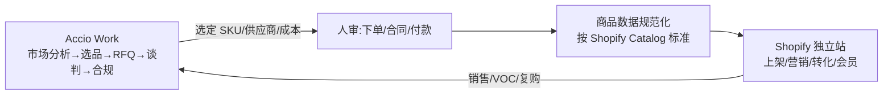

# 🤝 Accio Work × Shopify 接入与协作 SOP

## 0. 先认清边界(关键)
- **Accio Work 是什么**:Alibaba International 2026-03 推出的"agentic 业务团队"——AI 智能体团队做市场分析、选品、RFQ 与多轮供应商谈判、100+ 市场合规(VAT/退税/海关)、跨市场营销与物流(经 WhatsApp/Telegram),背靠阿里巴巴贸易数据;有桌面端(mac/Win)与 web 版,已服务 23 万+ 商家〔web:Alibaba/PRNewswire〕。
- **它不是什么**:**它不建/不运营你的 Shopify 站**——它管理的是 Alibaba.com 店铺 + B2B 采购侧。
- **正确协作姿势**:**Accio = 上游(找货/谈价/合规/铺市场),Shopify 原生 = 下游(建站/PDP/转化/会员/品牌)**;二者通过"商品与供应商数据"交接,由 [[10-自动化编排]] 的编排层统一调度。

## 1. 数据流

## 2. 接入 SOP(你来操作账号,我不替你登录)
1. **前置**:注册/登录 Alibaba.com(Accio.com)账号;按需装 Accio Work 桌面端或用 web 版。
2. **配置业务画像**:品类(母婴/吸奶器等)、目标市场(北美/欧洲/东南亚)、预算与合规区域。
3. **委派任务**:让 Agent 团队跑「市场分析 → 选品 → 生成 RFQ → 多轮谈判 → 打样」。
4. **封装 skill**:把你成熟的选品/采购流程沉淀成可复用 Accio "skill"(可共享/复用)。
5. **交接到 Shopify**:导出选定 SKU/供应商/成本 → 按 Catalog 标准规范化(见 [[03-商品上架与Listing]])→ 导入 Shopify。
6. **Shopify 原生接管**:建站/上架/营销/转化/会员按本库各节点执行。

## 3. 任务边界
| 交给 Accio Work | 留给 Shopify 原生 / 自建 | 必须人审(我不代办) |
|---|---|---|
| 选品、找供应商、RFQ、谈判初轮 | 建站、PDP、CRO、会员、品牌 | 下单 / 付款 / 签合同 / 定价 |
| VAT/关税/海关合规、海外仓物流协调 | GA4/归因、Shopify 自动化编排 | 资金转移 / 授权第三方扣款 |
| 跨市场 B2B 营销 | DTC 投放(Campaign Autopilot) | 账号授权 / 权限变更 |

## 4. 风险与合规(见 [[91-合规与风控]])
- **生态锁定 / 数据归属**:核心数据沉淀在阿里生态,评估数据出境与可迁移性;与自建数据层([[07-数据与归因]])口径对齐。
- **资金/合同动作**:RFQ 可自动,但**下单/付款/合同必须人审**;我可协助梳理,但不替你执行任何交易或转账。
- **多市场合规**:VAT/海关由 Accio 自动化时,保留可审计日志。

## 5. 我能帮你做的
- 已写好本 SOP;你登录后,我可用 **Claude-in-Chrome 陪你走一遍 UI**(只读/引导,不替你登录或下单),把实际步骤沉淀成截图与清单。
- 把 Accio 产出的选品/供应商数据**规范化为 Shopify Catalog 可导入格式**。
- 把"Accio 作为一个外部 Agent 团队"纳入 [[10-自动化编排]] 的编排蓝图与人审闸。
