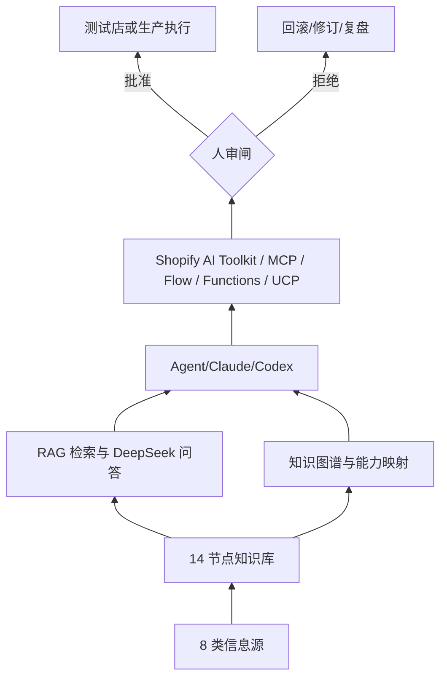

# PRD · ABI 智能化独立站

## 1. 背景
Shopify 独立站经营正在从“人手堆运营”转向“AI 辅助的代理式经营”。Spring 2026 之后,Shopify 原生能力、AI Toolkit、Storefront MCP、Catalog/UCP、Sidekick、Shopify Magic、Functions、Flow、Campaign Autopilot 等能力逐渐覆盖建站、上架、投放、转化、履约、客服与数据分析。

ABI 智能化独立站的目标是把这些能力组织成一套可治理的经营系统:知识库负责沉淀方法论,RAG 与知识图谱负责检索与溯源,Claude/Codex/AI Toolkit 等 Agent 负责读、写、改、查与编排,人审闸负责资金、发布、合规和不可逆写操作的最终控制。

## 2. 产品定位与商业价值
**产品定位**:面向跨境 DTC 团队的 Shopify AI 经营知识库与 Agent 编排底座,先服务“母婴/消费品独立站”场景,再扩展到多品牌、多区域、多店铺。

**商业价值**:
- 降本:用 Agent 承担资料整理、选品初筛、Listing 草稿、活动草案、客服知识整理等重复工作。
- 提效:把建站、上架、投放、CRO、履约、会员运营拆成可调用 skill 和 MCP 能力。
- 可复制:把节点 SOP、工具选型、数据桥、部署方式和验收标准沉淀成可迁移资产。
- 可治理:所有不可逆写操作经过人审,并保留操作日志、来源证据与回滚路径。

## 3. 用户角色
| 角色 | 主要诉求 | 典型动作 |
|---|---|---|
| 品牌负责人 | 明确赛道、预算、增长目标与风险边界 | 审批战略、预算、上线、改价、合同和资金动作 |
| 运营负责人 | 让日常运营可复制、可追踪、可复盘 | 选品、上架、投放、活动、会员、履约协同 |
| 内容/设计人员 | 快速生成可审的素材与 PDP 内容 | 脚本、图文、视频、广告素材、品牌叙事 |
| 数据/增长人员 | 统一口径,发现机会,量化实验 | GA4/GTM、归因、看板、CRO 实验和复盘 |
| Agent/开发执行者 | 按 SOP 调用工具并留下证据 | 检索 KB、读 Shopify、预演 mutation、执行已审批任务 |

## 4. 范围
### In Scope
- 00-10 全流程节点与 90/91/92 横切层的知识库、PRD、SOP 和验收标准。
- 页面化知识库、RAG 检索、DeepSeek 问答代理、图谱溯源、Claude Code skills 与 marketplace 插件。
- 选品到 Shopify 导入的数据桥、测试店受控读写流程、UCP/Catalog 接入规划。
- 人审闸、权限分级、操作审计、合规和回滚机制。

### Out of Scope
- 未经授权的真实店铺写操作、真实支付、真实下单、真实退款、真实广告投放。
- 绕过 YouTube/Reddit/GitHub/平台反爬或登录限制的数据采集。
- 不带来源证据的收入承诺、疗效/安全承诺、侵权素材使用。
- 在生产环境保存用户 API Key 或把密钥写入镜像、Git、前端静态文件。

## 5. 总体架构
架构参考 [`_diagrams/00_ABI总架构_architecture.png`](_diagrams/00_ABI总架构_architecture.png)。

核心原则:
- 读操作优先自动化;写操作先预演,再人审。
- 测试店先行;生产执行必须有授权、变更清单和回滚方案。
- 知识库新增内容必须进入 RAG、站点数据和必要的图谱关系。

## 6. 各节点功能需求
### 00 战略定位
| 字段 | 内容 |
|---|---|
| 主工具 | Claude/ChatGPT 研判 |
| 副工具 | Perplexity、Catalog 可见性 |
| 实现方法 | 季度战略评审,写入“宪法层”:赛道、区域、品牌定位、红线、单位经济约束 |
| 输入 | 市场规模、竞品、VOC、财务口径、区域法规、品牌定位材料 |
| 输出 | 战略基线、人群画像、区域优先级、单位经济假设、风险边界 |
| 人审闸 | 赛道选择、区域优先级、品牌红线 |
| 验收标准 | 形成战略基线、人群画像、单位经济与红线清单 |
| 依赖 | 01 选品调研、91 合规风控、07 数据归因 |

### 01 选品调研
| 字段 | 内容 |
|---|---|
| 主工具 | Helium10/JungleScout + Catalog |
| 副工具 | Trends/Perplexity、Claude 竞品分析、Accio 采购 |
| 实现方法 | 价带/市占/VOC 数据层 → 多视角 Agent 评分卡 → Accio RFQ → 数据桥导入 |
| 输入 | 品类 brief、价格带、毛利目标、供应商候选、竞品链接、关键词 |
| 输出 | 选品评分卡、候选 SKU、供应商与成本信息、导入 Shopify 的草稿 CSV |
| 人审闸 | 终审选品、打样、下单、合同、付款 |
| 验收标准 | 候选清单可追溯,导入数据默认 draft,风险项已标注 |
| 依赖 | 00 战略定位、03 商品上架、91 合规风控 |

### 02 建站基建
| 字段 | 内容 |
|---|---|
| 主工具 | AI Toolkit + Dev MCP(Claude Code) |
| 副工具 | 主题/OS2.0、Hydrogen、Functions |
| 实现方法 | `claude mcp add` 接 Dev MCP;自然语言建站/改店;长期 headless 用 Hydrogen → Oxygen |
| 输入 | 品牌规范、信息架构、主题选择、PDP/集合页需求、域名与支付配置清单 |
| 输出 | 可预览站点、多站点发布流水线、主题或 Hydrogen 项目、部署记录 |
| 人审闸 | 支付、域名、税费、隐私、上线 |
| 验收标准 | 测试店或预览环境可访问,关键页面可用,上线前清单通过 |
| 依赖 | 00 战略定位、03 商品上架、91 合规风控 |

### 03 商品上架与 Listing
| 字段 | 内容 |
|---|---|
| 主工具 | Shopify Magic + Catalog |
| 副工具 | ChatGPT/DeepSeek、DeepL/Gemini、custom-data |
| 实现方法 | 查资料 → Magic 生成文案 → metafields/metaobjects → admin-execution 批量预演 mutation |
| 输入 | 商品资料、图片、认证、供应商字段、卖点、关键词、多语言要求 |
| 输出 | PDP 草稿、集合页、SEO 字段、多语言内容、metafields |
| 人审闸 | 卖点真实性、合规措辞、上架发布 |
| 验收标准 | PDP/集合页字段完整,多语言可审,敏感声明已规避 |
| 依赖 | 01 选品调研、02 建站基建、91 合规风控 |

### 04 内容与素材生产
| 字段 | 内容 |
|---|---|
| 主工具 | Sidekick 出图 + 视频工作流 |
| 副工具 | Midjourney/Canva/PS、ElevenLabs、Suno、Kling/Runway |
| 实现方法 | 脚本/情绪公式 → 图生图/图生视频 → 配音配乐 → 审片 → 素材入库 |
| 输入 | 品牌调性、受众、产品卖点、广告 brief、素材版权信息 |
| 输出 | 图片、短视频、配音、音乐、素材库与投放版本 |
| 人审闸 | 品牌调性、版权、肖像、平台政策 |
| 验收标准 | 素材可追溯,版权状态明确,投放版本通过人工审片 |
| 依赖 | 00 战略定位、03 商品上架、05 营销引流 |

### 05 营销与引流
| 字段 | 内容 |
|---|---|
| 主工具 | Campaign Autopilot |
| 副工具 | Klaviyo/Omnisend、红人、活动页、Sidekick 扩展 |
| 实现方法 | 设置预算 → Autopilot 建活动/分配/优化 → 邮件流 → UTM 打标 → 复盘 |
| 输入 | 营销目标、预算、素材、受众、活动页、优惠策略 |
| 输出 | 多渠道活动、邮件流、UTM 规范、预算与效果报告 |
| 人审闸 | 预算、素材合规、优惠力度、外部达人合作 |
| 验收标准 | 活动有 UTM 与预算记录,效果可回流到看板 |
| 依赖 | 04 内容素材、07 数据归因、91 合规风控 |

### 06 转化优化 CRO
| 字段 | 内容 |
|---|---|
| 主工具 | Shopify Functions + Sidekick Pulse |
| 副工具 | AB 测试、checkout UI 扩展、IP 识别 |
| 实现方法 | Pulse 发现机会 → Functions 落地规则 → AB 实验 → 复盘 |
| 输入 | 漏斗数据、实验假设、折扣/满赠/校验规则、受众分组 |
| 输出 | Functions 规则、AB 实验记录、转化复盘、回滚方案 |
| 人审闸 | 实验上线、价格/折扣逻辑、结账规则 |
| 验收标准 | 实验记录完整,指标口径一致,可回滚 |
| 依赖 | 02 建站基建、05 营销引流、07 数据归因 |

### 07 数据与归因
| 字段 | 内容 |
|---|---|
| 主工具 | GA4/GTM + Sidekick Pulse |
| 副工具 | UTM 工具、BigQuery、看板、Magic 多步分析 |
| 实现方法 | 埋点规范 → 采集 → 归因 → 看板/每日简报 → 经营建议 |
| 输入 | 埋点方案、订单、广告、会员、渠道、VOC 数据 |
| 输出 | 归因看板、CLV、渠道 ROI、每日/周经营简报 |
| 人审闸 | 指标口径、数据权限、对外披露 |
| 验收标准 | 关键指标有定义、来源、窗口期与负责人 |
| 依赖 | 05 营销引流、06 CRO、09 客户会员 |

### 08 订单履约与供应链
| 字段 | 内容 |
|---|---|
| 主工具 | Shopify Flow + 库存同步 |
| 副工具 | 菜鸟/FBA/WFS 海外仓、Storefront MCP 查单、admin-execution |
| 实现方法 | 库存阈值 → Flow 告警/自动推单 → 海外仓对接 → 异常/退款处理 |
| 输入 | 库存、订单、仓库、物流、退款规则、供应商 SLA |
| 输出 | 库存同步、自动推单、异常告警、对话查单 |
| 人审闸 | 库存调整、退款、取消、批量履约变更 |
| 验收标准 | 订单/库存状态一致,异常有工单与处理记录 |
| 依赖 | 03 商品上架、07 数据归因、91 合规风控 |

### 09 客户与会员运营
| 字段 | 内容 |
|---|---|
| 主工具 | Store AI + Storefront MCP |
| 副工具 | Sidekick 扩展(Loop/Klaviyo)、SCRM、舆情、VOC |
| 实现方法 | Store AI 答疑 → VOC/舆情聚合 → 自动分群召回 → 高危工单升级 |
| 输入 | 订单、客户、客服知识库、评价、社媒反馈、会员标签 |
| 输出 | AI 客服、会员分群、召回策略、VOC 问题池 |
| 人审闸 | 高危工单、退款/补偿、敏感承诺、身份与隐私 |
| 验收标准 | 常见问题可自动答疑,高危问题自动升级,会员运营可追踪 |
| 依赖 | 07 数据归因、08 履约供应链、91 合规风控 |

### 10 自动化编排
| 字段 | 内容 |
|---|---|
| 主工具 | Claude Code + AI Toolkit + MCP + Flow |
| 副工具 | Zapier/Make、UCP、自建编排(CLAUDE.md/Trellis/Skill 库) |
| 实现方法 | 节点 skill 化 → 编排层调度 → 人审兜底 → 监控回滚 |
| 输入 | 节点 SOP、权限、触发器、审批规则、回滚策略 |
| 输出 | 可运行编排、任务日志、审批记录、失败回滚记录 |
| 人审闸 | 不可逆写、生产上线、资金/价格/权限变更 |
| 验收标准 | 测试店端到端跑通,每步有日志与人工确认点 |
| 依赖 | 00-09 全流程、90 AI 能力地图、91 合规风控、92 组织 SOP |

### 90 AI 能力地图
| 字段 | 内容 |
|---|---|
| 主工具 | 能力清单 + 选型表 |
| 副工具 | 术语表 |
| 实现方法 | 随 Shopify Editions、AI Toolkit、MCP/UCP 更新能力地图 |
| 输入 | 官方文档、开源仓库、教程、内部实践、工具评测 |
| 输出 | 能力清单、10 步映射、每节点工具选型、技能 SOP |
| 人审闸 | 无资金动作;涉及执行能力时转 91 审批 |
| 验收标准 | 每个节点有主副工具与启用条件 |
| 依赖 | 全部业务节点 |

### 91 合规与风控
| 字段 | 内容 |
|---|---|
| 主工具 | 权限分级 + 操作审计 + 审批闸 |
| 副工具 | 版权/采集校验、拒付控制 |
| 实现方法 | Agent 写操作留痕,敏感动作审批,异常可回滚 |
| 输入 | 权限模型、红线清单、平台政策、隐私/版权/广告规范 |
| 输出 | 审计日志、护栏清单、审批记录、风险复盘 |
| 人审闸 | 红线操作、资金动作、生产写入、外部采集 |
| 验收标准 | 关键操作有操作者、时间、输入、输出、审批与回滚记录 |
| 依赖 | 全部读写节点 |

### 92 组织 SOP
| 字段 | 内容 |
|---|---|
| 主工具 | Agent 工程三件套:CLAUDE.md/AGENTS.md + 记忆 + 人审 |
| 副工具 | Editions 跟新 SOP |
| 实现方法 | 评审 → 联调 → 提测 → 验收 → 上线 → 复盘 |
| 输入 | 项目计划、验收记录、部署证据、用户纠正、失败复盘 |
| 输出 | SOP、运维流水线、交接手册、候选经验 |
| 人审闸 | 长期记忆晋升、生产上线、权限变化 |
| 验收标准 | 状态文档与实际证据一致,复盘只进候选池并可人工晋升 |
| 依赖 | 全部节点、Codex/Claude 工作流 |

## 7. 非功能需求
- 性能:站点静态资源可本地检索;RAG 后端 `/api/health` 应返回 ok;生产容器需健康检查。
- 安全:API Key 由页面手动录入并随请求转发;默认不写服务器 env、镜像、Git 或前端静态文件。
- 合规:外部数据走“用户提供/授权导出/公开可用”路径;不绕过抓取限制。
- 可维护:新增源必须同步节点文档、图谱、RAG 和站点数据;脚本从自身路径推导 KB 根目录。
- 数据隐私:生产写操作、客户数据、支付、身份、订单管理必须按最小权限与审计要求处理。
- 可观测:部署、构建、检索、E2E、线上 smoke 都需要保留命令级证据。

## 8. 里程碑
| 阶段 | 目标 | 交付 |
|---|---|---|
| P0 | 可读、可检索、可验收 | T1 图修复、T2 网站迭代、T3 PRD |
| P1 | 生产化准备 | T4 检索升级、T5 上线、T6 多源深挖 |
| P2 | 自动化闭环 | T7 测试店接 AI-Toolkit/UCP,再做编排化 |

## 9. 验收
- 内容验收:14 节点 + 横切层全覆盖,每节点有主工具、副工具、实现方法、输入、输出、人审闸、验收标准、依赖。
- 检索验收:PRD 被纳入 `_rag/chunks.jsonl`,可用 `python _rag/kb_index/cli.py search "人审闸"` 检索。
- 站点验收:重建 `site/kb_data.js` 后,本地检索能搜到 PRD 片段。
- 部署验收:线上 `/api/health` ok;真实 API Key 由用户在页面手动录入后才能做 provider 问答验收。
- 风控验收:所有执行类节点都标明测试店先行、人审、日志与回滚。

## 10. 风险
| 风险 | 影响 | 对策 |
|---|---|---|
| 真实店铺写操作误触发 | 价格、库存、页面、订单产生生产影响 | 测试店先行;mutation 预演;人审批准后执行 |
| API Key 泄露 | 供应商费用与账号安全风险 | 页面手动录入;服务器不保存;Git/镜像扫描 |
| 外部采集违规 | 账号、合规和法律风险 | 不绕过限制;采用用户粘贴、授权导出或公开来源 |
| AI 输出夸大 | 品牌、广告、合规风险 | 来源标注;收入类案例只做打法参考;91 节点把关 |
| 检索召回不足 | Agent 决策依据不完整 | T4 引入生产嵌入与向量库;保留 LSA fallback |
| 组织流程漂移 | 文档与真实系统不一致 | 每次构建/部署后同步状态文档与证据 |
