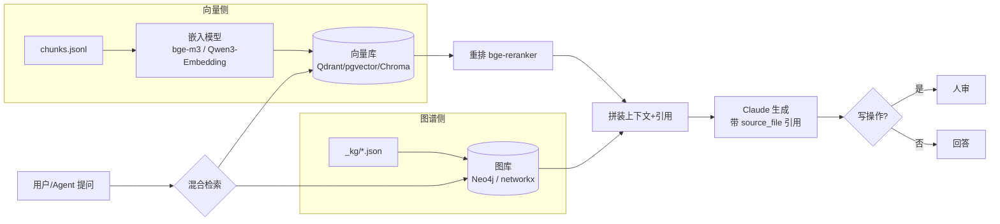

# 🔎 检索方案 — RAG + 知识图谱 可问答运营 Agent

目标:让 Claude/Agent 能"问知识库",并把答案落到具体节点 + 真实项目 + Shopify 能力,写操作过人审。

## 1. 已交付:离线原型 `kb_query.py`(零依赖)
- `search "<q>" [--stage 02] [--source shopify官方] [--tag ucp]` — TF-IDF(中文 char-bigram + 英文词)语义召回 + 元数据过滤。
- `graph <实体id>` — 看实体的出/入边(能力 SUPPORTS、相邻节点 NEXT、项目 BELONGS_TO…)。
- `ask "<q>"` — 混合:RAG 召回 + 主导节点的图谱关联(Shopify 能力 / 真实项目 / 下一节点)。
- 作用:**生产方案的参考实现**;无需联网/无外部依赖,可直接验证检索逻辑。

## 2. 生产架构(三步升级原型)

**Step 1 — 向量召回**:`chunks.jsonl` 的 `text` 用中文友好嵌入(bge-m3 / Qwen3-Embedding,或 OpenAI text-embedding-3)向量化入 Qdrant/pgvector;查询按 `stage/tags/sources` 元数据过滤(payload filter)。
**Step 2 — 图谱扩展(GraphRAG)**:把 `_kg/entities.json`+`relations.json` 导入 Neo4j;对召回命中的主导节点做 1 跳扩展(SUPPORTS 能力、BELONGS_TO 项目、NEXT/FEEDS_BACK 相邻),补进上下文。
**Step 3 — 服务化**:封装为 MCP server,暴露 `kb.search / kb.graph / kb.ask`,任何 Agent(Claude Code)都能调用;或做成 Cowork 网页 artifact 供人查询。

## 3. 与运营 Agent 的衔接
- 检索结果带 `source_file` → 答案可溯源(周报/官方/书签)。
- `stage` 字段让 Agent **按节点路由**:问"投放"→ 命中 05 → 拉 Campaign Autopilot 能力 + 广告中台项目。
- 写操作(改价/上架/退款/投放)接 [[10-自动化编排]] 的人审闸。

## 4. 选型建议
- 嵌入:中文为主选 **bge-m3** 或 **Qwen3-Embedding**(开源、可本地);省事用 OpenAI text-embedding-3-large。
- 向量库:轻量 **Chroma**;要规模/过滤强用 **Qdrant** 或 **pgvector**。
- 图库:轻量 **networkx**(直接读 graph.json);要查询语言/规模用 **Neo4j**(JSON 可直接转节点/边)。
